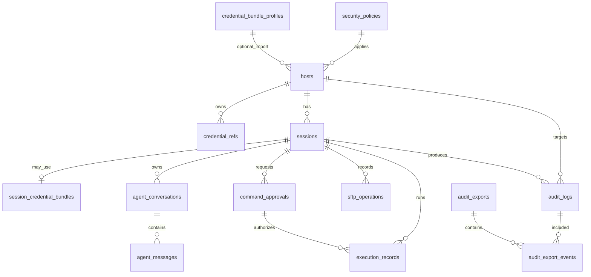

# TermPilot 数据库表设计

版本：1.0（个人部署版）  
日期：2026-09-03  
适用范围：Windows 个人部署版

## 1. 设计范围

本设计用于 TermPilot 的本地 SQLite 数据库，覆盖：

- 普通 SSH 主机和 SSH 堡垒机/访问网关配置；
- 密码、私钥和 SSH Agent 的凭据引用；
- SSH 会话、PTY、SFTP、AI 对话和命令审批；
- 本地安全策略和本地审计；
- JSONL/CSV 审计导出；
- OpenAI-compatible/Ollama 模型 Profile 缓存。

个人版不设计 SIEM 投递、审计 outbox、企业 CA/mTLS、企业签名证书、TPM/智能卡或多用户共享表。

大模型配置文件不存放在数据库中：TermPilot 参考 `%USERPROFILE%\\.codex` 的目录组织方式，但实际模型定义和认证引用统一放在同级的 `%USERPROFILE%\\.termpilot`。项目目录 `<project-root>/.termpilot` 只保存项目设置和用户级 Profile 名称引用，不能定义模型地址或密钥；`.codex` 不被运行时读取。

## 2. 敏感数据边界

数据库只保存业务数据和不可逆的审计摘要，不保存以下内容：

- SSH 密码、堡垒机密码、私钥正文、私钥口令、API Key、Token、Cookie；
- 四字段凭据包原文；
- 完整终端输出、完整文件内容和未脱敏的模型上下文。

密码等秘密由 Windows Credential Manager/DPAPI 保护，数据库只保存 `credential_refs` 中的引用、保存期限和解锁策略。私钥只保存 Credential Manager 引用或用户选择的私钥路径，不把私钥内容写入 SQLite。

当前堡垒机示例应按结构化字段保存：

| 字段 | 示例 |
|---|---|
| `address` | `jtdcblj2.zhenergy.com.cn` |
| `port` | `8022` |
| `username` | `u890374m2` |
| 标准命令 | `ssh -p 8022 u890374m2@jtdcblj2.zhenergy.com.cn` |

`https://jtdcblj.zhenergy.com.cn` 是网页管理地址，不应直接写入 SSH 主机的 `address`，除非后续确认该地址同时提供 SSH 服务。

## 3. 数据库约定

- 数据库文件位于当前 Windows 用户的 `%LOCALAPPDATA%\\TermPilot\\data\\termpilot.db`。
- 使用 WAL、外键和事务；数据库、WAL、SHM 文件均使用当前用户 ACL。
- 所有时间使用 UTC ISO-8601 文本，例如 `2026-09-03T08:30:00Z`。
- 所有业务 ID 使用应用生成的 UUID/ULID 文本；审计 `event_id` 必须稳定且唯一。
- `BOOLEAN` 使用 `INTEGER NOT NULL CHECK (value IN (0,1))` 表示。
- 删除主机使用软删除；审计日志不提供业务删除接口。
- JSON 字段使用 UTF-8 文本保存；写入前由应用完成 Schema 校验和脱敏。

## 4. 表关系



## 5. SQLite 初始化 DDL

以下 DDL 是首版结构基线。应用生成的 UUID、JSON Schema、哈希链连续性和秘密字段禁止规则仍必须在 Rust 业务层再次校验。

```sql
PRAGMA journal_mode = WAL;
PRAGMA foreign_keys = ON;
PRAGMA busy_timeout = 5000;

CREATE TABLE schema_migrations (
  version          INTEGER PRIMARY KEY,
  checksum         TEXT NOT NULL,
  applied_at       TEXT NOT NULL
);

CREATE TABLE app_settings (
  key              TEXT PRIMARY KEY,
  value            TEXT NOT NULL,
  value_type       TEXT NOT NULL CHECK (value_type IN ('string','integer','boolean','json')),
  updated_at       TEXT NOT NULL
);

CREATE TABLE security_policies (
  id               TEXT PRIMARY KEY,
  name             TEXT NOT NULL COLLATE NOCASE,
  mode             TEXT NOT NULL CHECK (mode IN (
                     'readonly', 'ask_before_execute',
                     'allow_safe_commands', 'manual_only'
                   )),
  allow_rules_json TEXT NOT NULL DEFAULT '[]',
  deny_rules_json  TEXT NOT NULL DEFAULT '[]',
  limits_json      TEXT NOT NULL DEFAULT '{}',
  version          INTEGER NOT NULL CHECK (version > 0),
  is_active        INTEGER NOT NULL DEFAULT 1 CHECK (is_active IN (0,1)),
  created_at       TEXT NOT NULL,
  updated_at       TEXT NOT NULL,
  UNIQUE (name, version)
);

CREATE UNIQUE INDEX idx_security_policies_active_name
  ON security_policies(name) WHERE is_active = 1;

CREATE TABLE credential_bundle_profiles (
  id               TEXT PRIMARY KEY,
  name             TEXT NOT NULL COLLATE NOCASE,
  parser_kind      TEXT NOT NULL CHECK (parser_kind = 'credential_bundle_v1'),
  parser_version   INTEGER NOT NULL DEFAULT 1 CHECK (parser_version > 0),
  source_mode      TEXT NOT NULL CHECK (source_mode IN ('clipboard','manual')),
  config_json      TEXT NOT NULL DEFAULT '{}',
  created_at       TEXT NOT NULL,
  updated_at       TEXT NOT NULL,
  UNIQUE (name, parser_kind, parser_version)
);

CREATE TABLE hosts (
  id                       TEXT PRIMARY KEY,
  name                     TEXT NOT NULL COLLATE NOCASE,
  connection_type          TEXT NOT NULL CHECK (connection_type IN (
                             'direct_ssh', 'bastion_endpoint'
                           )),
  address                  TEXT NOT NULL,
  port                     INTEGER NOT NULL CHECK (port BETWEEN 1 AND 65535),
  username                 TEXT NOT NULL,
  auth_method              TEXT NOT NULL CHECK (auth_method IN (
                             'password', 'private_key', 'ssh_agent'
                           )),
  group_name               TEXT,
  is_production            INTEGER NOT NULL DEFAULT 0 CHECK (is_production IN (0,1)),
  production_mark_source   TEXT NOT NULL DEFAULT 'manual' CHECK (
                             production_mark_source = 'manual'
                           ),
  workspace_root           TEXT,
  endpoint_fingerprint     TEXT,
  remote_identity_hmac     TEXT,
  credential_bundle_profile_id TEXT,
  policy_id                TEXT,
  notes                    TEXT,
  created_at               TEXT NOT NULL,
  updated_at               TEXT NOT NULL,
  deleted_at               TEXT,
  FOREIGN KEY (credential_bundle_profile_id)
    REFERENCES credential_bundle_profiles(id),
  FOREIGN KEY (policy_id)
    REFERENCES security_policies(id)
);

CREATE UNIQUE INDEX idx_hosts_name_active
  ON hosts(name) WHERE deleted_at IS NULL;
CREATE INDEX idx_hosts_group_active
  ON hosts(group_name, updated_at) WHERE deleted_at IS NULL;
CREATE INDEX idx_hosts_endpoint
  ON hosts(address, port) WHERE deleted_at IS NULL;

CREATE TABLE credential_refs (
  id               TEXT PRIMARY KEY,
  host_id          TEXT NOT NULL,
  kind             TEXT NOT NULL CHECK (kind IN ('password','private_key','ssh_agent')),
  target_name      TEXT NOT NULL,
  secret_location  TEXT NOT NULL DEFAULT 'windows_credential_manager' CHECK (
                     secret_location IN ('windows_credential_manager','user_file','ssh_agent')
                   ),
  retention_mode   TEXT NOT NULL CHECK (retention_mode IN (
                     'never', 'app_session', 'expires_at', 'persistent'
                   )),
  unlock_policy    TEXT NOT NULL CHECK (unlock_policy IN (
                     'current_user', 'hello_startup', 'hello_each_connection'
                   )),
  expires_at       TEXT,
  created_at       TEXT NOT NULL,
  last_used_at     TEXT,
  revoked_at       TEXT,
  FOREIGN KEY (host_id) REFERENCES hosts(id) ON DELETE CASCADE,
  CHECK ((kind = 'password' AND secret_location = 'windows_credential_manager')
      OR (kind = 'private_key' AND secret_location IN ('windows_credential_manager','user_file'))
      OR (kind = 'ssh_agent' AND secret_location = 'ssh_agent')),
  CHECK ((retention_mode = 'expires_at' AND expires_at IS NOT NULL)
      OR (retention_mode <> 'expires_at' AND expires_at IS NULL)),
  UNIQUE (host_id, kind),
  CHECK (retention_mode IN ('never','app_session') OR secret_location <> 'ssh_agent'
      OR kind = 'ssh_agent')
);

CREATE INDEX idx_credential_refs_expiry
  ON credential_refs(expires_at) WHERE revoked_at IS NULL;

CREATE TABLE sessions (
  id                         TEXT PRIMARY KEY,
  host_id                    TEXT NOT NULL,
  status                     TEXT NOT NULL CHECK (status IN (
                             'connecting', 'ready', 'reconnecting',
                             'disconnected', 'closed', 'error'
                           )),
  observed_endpoint_fingerprint TEXT,
  observed_remote_identity_hmac TEXT,
  pty_rows                   INTEGER CHECK (pty_rows BETWEEN 1 AND 1000),
  pty_cols                   INTEGER CHECK (pty_cols BETWEEN 1 AND 1000),
  started_at                 TEXT NOT NULL,
  ended_at                   TEXT,
  last_seq                   INTEGER NOT NULL DEFAULT 0 CHECK (last_seq >= 0),
  disconnect_reason          TEXT,
  FOREIGN KEY (host_id) REFERENCES hosts(id),
  CHECK ((pty_rows IS NULL AND pty_cols IS NULL)
      OR (pty_rows IS NOT NULL AND pty_cols IS NOT NULL))
);

CREATE INDEX idx_sessions_host_status
  ON sessions(host_id, status, started_at);

CREATE TABLE session_credential_bundles (
  id                         TEXT PRIMARY KEY,
  session_id                 TEXT NOT NULL UNIQUE,
  profile_id                 TEXT,
  format_version             TEXT,
  source                     TEXT NOT NULL CHECK (source IN ('manual','clipboard_bundle')),
  credential_ref_id          TEXT,
  status                     TEXT NOT NULL CHECK (status IN (
                             'parsed', 'used', 'expired', 'rejected'
                           )),
  imported_at                TEXT NOT NULL,
  FOREIGN KEY (session_id) REFERENCES sessions(id),
  FOREIGN KEY (profile_id) REFERENCES credential_bundle_profiles(id),
  FOREIGN KEY (credential_ref_id) REFERENCES credential_refs(id)
);

CREATE TABLE agent_conversations (
  id                         TEXT PRIMARY KEY,
  session_id                 TEXT NOT NULL,
  model_profile_name         TEXT,
  summary                    TEXT,
  token_count                INTEGER NOT NULL DEFAULT 0 CHECK (token_count >= 0),
  status                     TEXT NOT NULL DEFAULT 'active' CHECK (
                             status IN ('active','completed','cancelled','error')
                           ),
  created_at                 TEXT NOT NULL,
  updated_at                 TEXT NOT NULL,
  FOREIGN KEY (session_id) REFERENCES sessions(id) ON DELETE CASCADE
);

CREATE INDEX idx_agent_conversations_session
  ON agent_conversations(session_id, updated_at);

CREATE TABLE agent_messages (
  id                         INTEGER PRIMARY KEY AUTOINCREMENT,
  conversation_id            TEXT NOT NULL,
  role                       TEXT NOT NULL CHECK (role IN ('system','user','assistant','tool')),
  content                    TEXT,
  tool_call_json             TEXT,
  redaction_summary_json     TEXT,
  created_at                 TEXT NOT NULL,
  FOREIGN KEY (conversation_id) REFERENCES agent_conversations(id) ON DELETE CASCADE,
  CHECK (content IS NOT NULL OR tool_call_json IS NOT NULL)
);

CREATE INDEX idx_agent_messages_conversation
  ON agent_messages(conversation_id, id);

CREATE TABLE command_approvals (
  id                         TEXT PRIMARY KEY,
  session_id                 TEXT NOT NULL,
  policy_id                  TEXT,
  argv_json                  TEXT NOT NULL,
  cwd                        TEXT,
  command_hash               TEXT NOT NULL,
  risk                       TEXT NOT NULL CHECK (risk IN (
                             'low','medium','high','critical','blocked'
                           )),
  policy_version             INTEGER NOT NULL CHECK (policy_version > 0),
  approval_scope             TEXT NOT NULL CHECK (approval_scope IN (
                             'once','session'
                           )),
  status                     TEXT NOT NULL CHECK (status IN (
                             'pending','approved','rejected','expired','consumed'
                           )),
  decision_reason            TEXT,
  created_at                 TEXT NOT NULL,
  decided_at                 TEXT,
  expires_at                 TEXT NOT NULL,
  FOREIGN KEY (session_id) REFERENCES sessions(id),
  FOREIGN KEY (policy_id) REFERENCES security_policies(id)
);

CREATE INDEX idx_command_approvals_pending
  ON command_approvals(session_id, status, expires_at);
CREATE UNIQUE INDEX idx_command_approvals_hash_active
  ON command_approvals(session_id, command_hash, policy_version)
  WHERE status IN ('pending','approved');

CREATE TABLE execution_records (
  id                         TEXT PRIMARY KEY,
  session_id                 TEXT NOT NULL,
  approval_id                TEXT,
  authorization_type         TEXT NOT NULL CHECK (authorization_type IN (
                             'approval','policy_allowlist','dry_run'
                           )),
  allow_rule_id              TEXT,
  policy_version             INTEGER,
  command_hash               TEXT NOT NULL,
  channel                    TEXT NOT NULL CHECK (channel IN ('exec','pty')),
  started_at                 TEXT NOT NULL,
  ended_at                   TEXT,
  status                     TEXT NOT NULL CHECK (status IN (
                             'running','succeeded','failed','cancelled','blocked'
                           )),
  exit_code                  INTEGER,
  stdout_hash                TEXT,
  stderr_hash                TEXT,
  output_bytes               INTEGER NOT NULL DEFAULT 0 CHECK (output_bytes >= 0),
  truncated                  INTEGER NOT NULL DEFAULT 0 CHECK (truncated IN (0,1)),
  FOREIGN KEY (session_id) REFERENCES sessions(id),
  FOREIGN KEY (approval_id) REFERENCES command_approvals(id),
  CHECK ((authorization_type = 'approval' AND approval_id IS NOT NULL)
      OR (authorization_type = 'policy_allowlist' AND allow_rule_id IS NOT NULL)
      OR (authorization_type = 'dry_run'))
);

CREATE INDEX idx_execution_records_session_time
  ON execution_records(session_id, started_at);

CREATE TABLE sftp_operations (
  id                         TEXT PRIMARY KEY,
  session_id                 TEXT NOT NULL,
  operation                  TEXT NOT NULL CHECK (operation IN (
                             'list','read','upload','download','delete','rename','mkdir'
                           )),
  source_path                TEXT,
  destination_path           TEXT,
  source_path_hash           TEXT,
  destination_path_hash      TEXT,
  size_bytes                 INTEGER CHECK (size_bytes IS NULL OR size_bytes >= 0),
  transferred_bytes          INTEGER NOT NULL DEFAULT 0 CHECK (transferred_bytes >= 0),
  status                     TEXT NOT NULL CHECK (status IN (
                             'queued','running','paused','succeeded','failed','cancelled'
                           )),
  overwrite_confirmed        INTEGER NOT NULL DEFAULT 0 CHECK (overwrite_confirmed IN (0,1)),
  content_hash               TEXT,
  error_code                 TEXT,
  created_at                 TEXT NOT NULL,
  started_at                 TEXT,
  ended_at                   TEXT,
  FOREIGN KEY (session_id) REFERENCES sessions(id)
);

CREATE INDEX idx_sftp_operations_session_time
  ON sftp_operations(session_id, started_at);

CREATE TABLE audit_logs (
  id                         INTEGER PRIMARY KEY AUTOINCREMENT,
  event_id                   TEXT NOT NULL UNIQUE,
  schema_version             INTEGER NOT NULL DEFAULT 1 CHECK (schema_version > 0),
  event_type                 TEXT NOT NULL,
  severity                   TEXT NOT NULL CHECK (severity IN ('info','warning','error','critical')),
  actor                      TEXT NOT NULL,
  target_host_id             TEXT,
  session_id                 TEXT,
  correlation_id             TEXT,
  payload_json               TEXT NOT NULL,
  prev_hash                  TEXT,
  hash                       TEXT NOT NULL,
  created_at                 TEXT NOT NULL,
  FOREIGN KEY (target_host_id) REFERENCES hosts(id),
  FOREIGN KEY (session_id) REFERENCES sessions(id)
);

CREATE INDEX idx_audit_logs_time_type
  ON audit_logs(created_at, event_type);
CREATE INDEX idx_audit_logs_correlation
  ON audit_logs(correlation_id);
CREATE INDEX idx_audit_logs_host_time
  ON audit_logs(target_host_id, created_at);

CREATE TABLE audit_exports (
  id                         TEXT PRIMARY KEY,
  format                     TEXT NOT NULL CHECK (format IN ('jsonl','csv')),
  filter_json                TEXT NOT NULL DEFAULT '{}',
  first_event_id             TEXT,
  last_event_id              TEXT,
  event_count                INTEGER NOT NULL DEFAULT 0 CHECK (event_count >= 0),
  file_hash                  TEXT,
  manifest_hash              TEXT,
  output_path                TEXT,
  status                     TEXT NOT NULL CHECK (status IN ('running','succeeded','failed')),
  created_at                 TEXT NOT NULL,
  completed_at               TEXT
);

CREATE TABLE audit_export_events (
  export_id                   TEXT NOT NULL,
  event_id                    TEXT NOT NULL,
  PRIMARY KEY (export_id, event_id),
  FOREIGN KEY (export_id) REFERENCES audit_exports(id) ON DELETE CASCADE,
  FOREIGN KEY (event_id) REFERENCES audit_logs(event_id)
);

CREATE INDEX idx_audit_export_events_event
  ON audit_export_events(event_id);

CREATE TABLE model_profile_cache (
  name                       TEXT PRIMARY KEY COLLATE NOCASE,
  provider                   TEXT NOT NULL,
  model                      TEXT NOT NULL,
  base_url                   TEXT,
  temperature                REAL CHECK (temperature IS NULL OR temperature BETWEEN 0 AND 2),
  timeout_ms                 INTEGER CHECK (timeout_ms IS NULL OR timeout_ms > 0),
  endpoint_scope             TEXT NOT NULL CHECK (endpoint_scope IN ('public','local','custom')),
  auth_ref_target            TEXT,
  egress_policy_id           TEXT,
  source_scope               TEXT NOT NULL DEFAULT 'user_termpilot' CHECK (source_scope = 'user_termpilot'),
  source_path                TEXT,
  capabilities_json          TEXT NOT NULL DEFAULT '{}',
  validated_at               TEXT,
  created_at                 TEXT NOT NULL,
  updated_at                 TEXT NOT NULL
);

CREATE INDEX idx_model_profiles_provider_model
  ON model_profile_cache(provider, model);
```

## 6. 表说明

### 6.1 `schema_migrations`：数据库版本

记录已执行的数据库迁移版本和脚本校验值。应用启动时先完成迁移，再开放 SSH、SFTP 和 Agent 功能。

### 6.2 `app_settings`：个人应用设置

只保存非秘密的全局设置，例如默认策略 ID、审计保留天数、网络代理开关、界面主题和快捷键。密码、API Key、Token、私钥和 Cookie 不得以任何 `key` 写入此表。

### 6.3 `security_policies`：本地安全策略

保存当前 Windows 用户维护的命令允许列表、拒绝列表和执行限额。`version` 每次变更递增；审批票据和执行记录保存当时的策略版本，策略版本变化后旧票据必须失效。

### 6.4 `credential_bundle_profiles`：可选四字段解析配置

只保存解析器类型和非秘密配置，不保存凭据包原文。个人版默认入口是手工填写 SSH 参数；用户需要时才启用 `credential_bundle_v1` 剪贴板导入。

### 6.5 `hosts`：SSH 主机和堡垒机端点

`connection_type` 区分普通 SSH 主机和堡垒机/访问网关端点。两者都使用相同的 `address`、`port`、`username` 和 `auth_method` 结构化字段。`https://` 网页地址不能自动转换为 SSH 地址。

`endpoint_fingerprint` 保存首次确认的 SSH 主机指纹；`remote_identity_hmac` 在用户同意后保存远端稳定身份的加盐/HMAC 摘要，不保存原始敏感信息。

### 6.6 `credential_refs`：凭据安全引用

该表只记录秘密存储位置和生命周期。对于 `never` 和 `app_session`，`target_name` 仅为随机引用，应用退出或会话结束时清理，不代表数据库保存了密码：

- `password`：`target_name` 指向 Windows Credential Manager 条目；
- `private_key`：`target_name` 指向 Credential Manager 引用或用户私钥文件；
- `ssh_agent`：`target_name` 保存 Agent 中选定的公钥指纹或键标识。

实际密码和私钥内容永远不进入本表。

### 6.7 `sessions`：SSH 会话

记录会话状态、PTY 尺寸、实际观测到的端点指纹和远端身份摘要。动态密码、私钥正文和终端全文不保存。

### 6.8 `session_credential_bundles`：会话凭据使用结果

用于关联某次手工连接或可选四字段导入。会话结束后只保留格式版本、来源、随机 ID 和成功/失败状态，不保存四行文本或密码。

### 6.9 `agent_conversations` / `agent_messages`：AI 对话

对话内容必须先经过上下文截断和脱敏。`tool_call_json` 只保存结构化工具参数，不允许写入密码、私钥、Token 或原始凭据包。

### 6.10 `command_approvals`：命令审批

保存结构化 `argv_json`、命令哈希、风险、策略版本、审批范围和有效期。禁止把整条 Shell 字符串当作未解析参数保存或执行；执行前必须再次校验上下文和策略版本。

### 6.11 `execution_records`：执行结果

保存授权类型、命令哈希、退出码、耗时、输出哈希和截断状态。输出正文不保存；`policy_allowlist` 必须关联 `allow_rule_id`，普通审批必须关联 `approval_id`。

### 6.12 `sftp_operations`：SFTP 操作

保存操作类型、脱敏路径或路径哈希、大小、进度、状态和内容哈希。路径必须经过工作区根目录和符号链接校验；密码和文件正文不保存。

### 6.13 `audit_logs`：本地审计链

每条事件使用 `prev_hash` 指向上一条事件的 `hash`，应用按追加顺序写入。`payload_json` 只能包含脱敏后的事件信息。个人版本地哈希链用于发现普通篡改或损坏，不等同于企业级不可抵赖审计。

### 6.14 `audit_exports`：本地审计导出

记录 JSONL/CSV 导出的筛选条件、事件范围、数量、文件哈希和 manifest 哈希。个人版不保存证书指纹、不生成 CMS/PKCS#7 签名，也不上传 SIEM。

### 6.15 `audit_export_events`：导出事件明细

保存一次导出实际包含的 `event_id`，避免仅依赖筛选条件或首尾 ID 推断导出内容。删除导出记录时通过级联删除明细，不影响原始审计事件。

### 6.16 `model_profile_cache`：模型 Profile 缓存

缓存来自用户级 `%USERPROFILE%\\.termpilot` 的 provider、model、Base URL、超时、能力探测结果和外发策略引用。`source_scope` 固定为 `user_termpilot`；项目 `.termpilot` 只能保存 Profile 名称引用，`.codex` 不能作为来源。API Key 只保存 Credential Manager 引用（如 `auth_ref_target`），不得保存 Key 本身。

## 7. 关键业务约束

1. **SSH 连接参数**：`address`、`port`、`username` 和 `auth_method` 必须分别校验。端口 `8022` 是连接端口，不能作为登录后的远程命令。
2. **网页与 SSH 分离**：`https://jtdcblj.zhenergy.com.cn` 仅作为网页入口记录在应用外部说明中；只有经确认的 SSH 端点才写入 `hosts.address`。
3. **凭据引用完整性**：`credential_refs` 只能关联当前用户的 `hosts`；到期或撤销的引用不得自动重连。
4. **堡垒机目标身份**：凭据包或手工参数不一定包含目标资源 ID；端点指纹或远端身份摘要发生变化时，Agent 和 SFTP 默认阻断并要求人工确认。
5. **审计先行**：执行 Agent 命令前，授权决策和审计事件必须在同一 SQLite 事务中落盘；审计写入失败时不得向远端发送自动执行命令。
6. **秘密零落盘**：秘密不得进入 SQLite、WAL/SHM、日志、崩溃转储、审计正文、AI 消息或导出文件。
7. **本地隔离**：数据库目录、备份和日志只允许当前 Windows 用户访问；个人版不提供跨 Windows 用户共享。
8. **软删除与保留**：主机采用 `deleted_at` 软删除；审计事件按 `app_settings` 中的本地保留期归档，归档前先生成 JSONL/CSV 备份。
9. **模型配置位置**：模型定义只从 `%USERPROFILE%\\.termpilot` 加载；项目配置只能引用 Profile；`.codex` 只用于设计参考，不能出现在 `model_profile_cache.source_path`。

## 8. 建议迁移顺序

1. 创建 `app_settings`、`security_policies` 和 `credential_bundle_profiles`。
2. 创建 `hosts`、`credential_refs`、`sessions` 和 `session_credential_bundles`。
3. 创建 Agent、审批、执行和 SFTP 表。
4. 创建 `audit_logs`、`audit_exports` 和模型 Profile 表。
5. 创建索引并执行 `PRAGMA foreign_key_check`。
6. 写入默认 `ask_before_execute` 策略；不得写入任何真实密码或 API Key。

## 9. 发布前数据库验收

- 能保存并重新读取 `jtdcblj2.zhenergy.com.cn:8022/u890374m2` 这类结构化 SSH 配置；不会把 `8022` 当作远程命令。
- 普通 SSH 和堡垒机端点均可建立会话；不支持 SFTP 的端点只禁用文件面板，不影响终端连接。
- 密码、私钥、API Key、Token 和凭据包原文在 SQLite、WAL/SHM、日志、审计和模型请求中均检索不到。
- 首次 SSH 指纹确认、指纹变化、认证失败、断线重连和凭据到期均有本地审计事件。
- 审批、执行和审计事件可以通过 `session_id`、`command_hash`、`correlation_id` 关联。
- JSONL/CSV 导出后，文件哈希和本地事件链校验成功；任意修改导出文件都能被检测。
- 删除或修改数据库文件后，应用能够安全失败，不自动执行远程命令。
